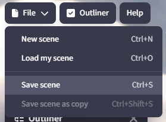

+++
title = "Saving and Loading Scenes"
slug = "saving-loading-scenes"
date = "2024-08-08"
template= "blog_template/page.html" 
authors = ["Heart Ribbon"]

[taxonomies]
categories = ["tutorial"]

[extra]
cover_image = "/learn/saving-loading-scenes/scenescover.png"
+++

# Saving and Loading Scenes
To name your scene, go to the top of the studio where it says “Untitled New Scene” (or it may already have a name if it's a remix scene). Click the scene name to edit it. To save the scene, click “File” in the top left corner, then “Save Scene.” The page will reload—this is normal. Be sure to save any changes you make afterward.

To save a copy of your scene, follow the same steps but click “Save Scene as Copy” instead.

To load a scene, click “File” in the top left corner, then “Load my Scene.”
{{ youtube(id="5JEk8Af4EZE") }}
{{ youtube(id="YXp_0ueHlsU") }}

