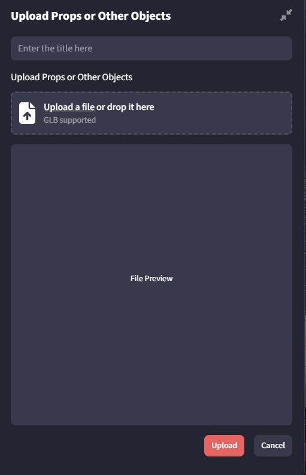

+++
title = "Uploading Objects and Characters"
slug = "uploading-objects-and-characters"
date = "2024-08-08"
template= "blog_template/page.html" 
authors = ["Heart Ribbon"]

[taxonomies]
categories = ["tutorial"]

[extra]
cover_image = "/learn/uploading-objects-and-characters/uploadingcover.png"
+++

# Uploading Objects and Characters
To upload your content and characters, ensure they are in GLB format with baked-in textures. Our character rigging system works only with Mixamo.

To upload an object, navigate to the desired object category, click “Upload,” name your item, and press “OK.” Your uploaded item will appear in the “Mine” tab.

If you encounter issues, please contact us on Discord.

